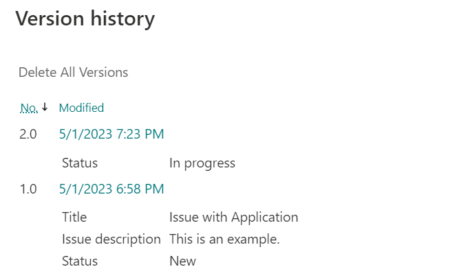
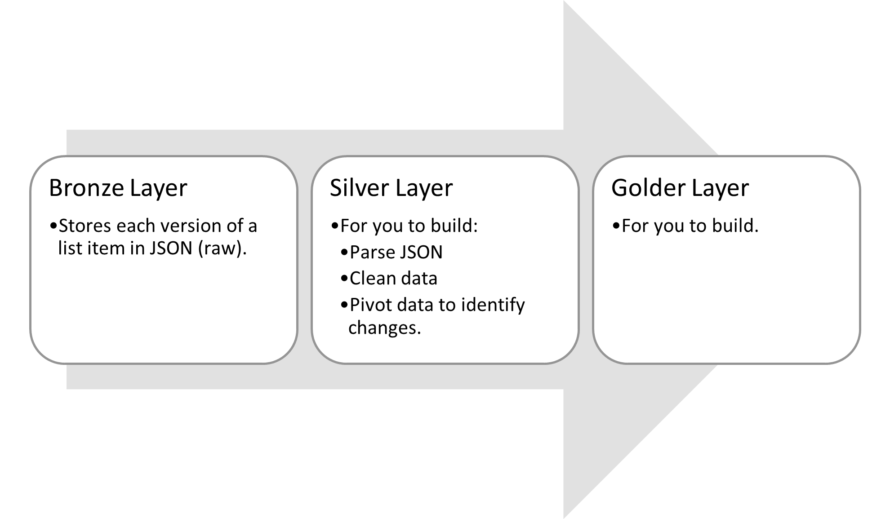
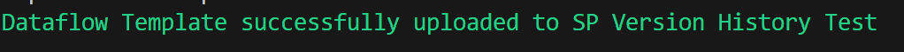
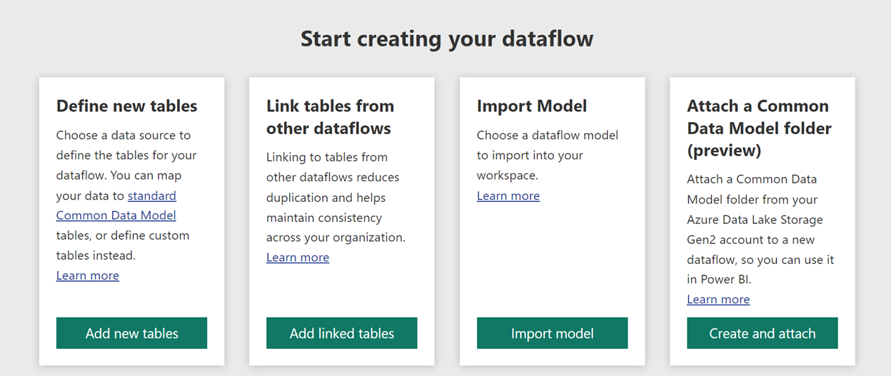

# power-query-sharepoint-version-history
Power BI Dataflow template for capturing version history for SharePoint using the Medallion architecture approach.

## Background

For those who don't know, a SharePoint list (and document library) can
be configured to store prior versions of a list item/document. In fact,
if you use SharePoint Online and created a list then this feature should
be enabled with a default of 500 versions. At the time of this writing
the maximum number of versions allowed under this feature <a href="https://support.microsoft.com/en-us/office/how-versioning-works-in-lists-and-libraries-0f6cd105-974f-44a4-aadb-43ac5bdfd247" target="_blank">is 50,000</a>.

From an analytics perspective this means you could evaluate the changes
in a list item's column values to do a time series analysis. This
analysis could be looking for bottlenecks in processes or calculating
metrics for how quickly a task is completed.

For example, if you have an Issue Tracker list, via the version history
interface you can see the timestamps for the Status of an issue to
change from New to In progress (see example in Figure 1). But that's for
one issue, what if you wanted to know how many hours it takes, on
average, for issues to have their status change from New to In progress?
That's where Power BI can help.

Figure 1: Example version history of a SharePoint list item

## The Challenge

But, as of May 2023, this type of analytics capability in Power BI can
be a challenge because:

1. Learning Curve - There is no native connector that can retrieve the version history from a SharePoint list. Thankfully there is an API endpoint to get version history for a SharePoint list item, but you're still left with using and learning Web.Contents. Web.Contents is a great function, but not one that is easily accessible through a low-code fashion.

2. Text Limit - A version of a list item could easily be over the text limit of <a href="https://www.inkeysolutions.com/blogs/power-bi-how-to-deal-with-a-text-column-having-a-length-of-more-than-32766-characters/" target="_blank">32,766 characters</a>. Text-based data over this limit is truncated in a Power BI dataset. In addition, what if you wanted to keep versions of the data in the raw format, so you could answer questions or test hypotheses that haven't been considered yet?

## Potential Solution

To overcome these challenges, this solution combines the lessons learned
from <a href="https://github.com/kerski/power-query-sharepoint-faster-easier" target="_blank">power-query-sharepoint-faster-easier</a>
and the capabilities of Power BI dataflow to store SharePoint list item
versions for analytic needs. Table 1 outlines how each challenge is
addressed with this solution.

| Challenge | Solution |
| --------- | -------- |
| Learning Curve | Leverage the techniques from <a href="https://github.com/kerski/power-query-sharepoint-faster-easier" target="_blank">A Faster (Easier?) way to import SharePoint list data into Power BI</a> to make generating the OData queries a low-code (easier) experience. |
| Text Limit | With Power BI dataflows, we can store data in text columns well over 32,766. I tried to find the theoretical limit documented, but I could not. However, I tested text columns close to 2 million records and I had no truncation in a Power BI dataflow. |

The solution uses the <a href="https://learn.microsoft.com/en-us/azure/databricks/lakehouse/medallion" target="_blank">Medallion architecture</a>
which separates responsibilities of each Power BI dataflow to support
consistency, flexibility, and durability with the data. The Bronze layer
is intended to get the raw data which in this solutions' case is the raw
JSON information for each version of a SharePoint list item. The Silver
layer <a href="https://learn.microsoft.com/en-us/power-query/dataflows/linked-entities" target="_blank">links the output</a>
of the Bronze layer and parses the JSON information, cleans it, and
pivots it. The Gold layer links to the Silver layer's output and
provides the knowledge to be used in a Power BI dataset. Going back to
our example in the "Background" section, the Gold layer would provide a
table of data that has a row for each list item, and it indicates how
long it takes for its status to change from New to In Progress.

As described in Figure 2, <i><b>the solution provides you the code to build
the Bronze Layer and I provide you with instructions to get
started on your Silver Layer</i></b>. After that, it's up to you to finish
building the Silver Layer and complete the Gold Layer.

Figure 2 - Medallion approach to ingesting SharePoint version history and Power BI dataflow.

## Bronze Layer Implementation

To implement this dataflow, please follow the directions below.

### Prerequisites

#### Power BI

-   A premium workspace or premium per user workspace in Power BI is
    required.

-   Those performing the installation steps has at least Contributor
    rights to the workspace.

#### Desktop

-   <a href="https://docs.microsoft.com/en-us/powershell/scripting/install/installing-powershell-on-windows?view=powershell-7.2" target="_blank">PowerShell 7</a> installed.
    If you are using Windows 10 or 11, this should be installed already.
    For the purposes of the instructions, I\'m going to use PowerShell
    ISE to run a PowerShell script.

### Installation

1.  Open PowerShell Version 7 and enter the following script:

2.  Invoke-WebRequest -Uri
    \"https://raw.githubusercontent.com/kerski/power-query-sharepoint-version-history/development/Scripts/Setup-SPTemplate.ps1\"
    -OutFile \".\\Setup-SPTemplate.ps1\"

3.  This will download the setup scripts to the current folder. Run
    .\\Setup-SPTemplate.ps1 in PowerShell. Please note that depending on
    your computer's settings, you may need to call
    <a href="https://learn.microsoft.com/en-us/powershell/module/microsoft.powershell.utility/unblock-file?view=powershell-7.3" target="_blank">Unblock-File</a>
    for the Setup-SPTemplate.ps1 to run it.

4.  During the install process you will be prompted to enter the
    following information:

    a.  The URL of the SharePoint site that contains the list you want
        to pull version history from.

    b.  The SharePoint list name.

    c.  The GUID of the premium or premium per user workspace.

5.  During the course of the install you may be prompted to enter your
    Microsoft 365 credentials. Depending on your environment you may
    have a browser tab appear to sign-in. After signing in you can
    return to the PowerShell window.

6.  If the script ran successfully you will be presented with a message
    similar in the image below.

Figure 3 - Example of successfully completed installation script.

7.  Navigate to the workspace where the dataflow was imported.

Figure 4 - Screenshot of dataflow uploaded

8.  Navigate to the additional options ("...") and select the "Settings"
    option.

Figure 5 - Dataset Settings

9.  Edit the Data Source Credentials and login with the appropriate
    account within your tenant.

Figure 6 - Data source credentials panel

10. Make sure to set the Authentication method to Oauth2, privacy level
    to Organizational and "Skip test connection". Then press the "Sign
    in" button and login with the appropriate credentials.

Figure 7 -  Screenshot for configuring credentials

11. Return back to the workspace screen and issue a manual refresh.
    Depending on the size of your list and the number of versions this
    may take some time.

12. Verify that the manual refresh completes.

## 429 -- Too Many Requests

For large lists (greater than 5,000) I've seen refreshes get the
throttled by the SharePoint API. Unfortunately, this solution is not
capable of natively avoiding this issue because the capability known as
<a href="https://learn.microsoft.com/en-us/power-query/handling-status-codes" target="_blank">ManualStatusHandling</a>
is only available for anonymous connections (and we need to use OAuth2
for SharePoint).

My hope is with upcoming releases to Power Query Online this can be
alleviated, so in the meantime here are design pattern options to get
around the 429 issues.

1)  **Option 1 - Parallelize the work** -- The ID Filter by default in
    the dataflow only retrieves the first 20 items for getting version
    history (see screenshot below). You could clone these workflows into
    increments of 5000 (approximately) to collect version history. For
    example, one dataflow would have the ID Filter "ID le 5000" and
    another dataflow would have the ID Filter "ID gt 5000 and ID lt
    10000". Just be sure to stagger refresh times so they run right
    after another.

Figure 8 - ID Filter limits the list items you retrieve.

2)  **Option 2 - Incremental Refresh** -- Now normally I would go to
    this option first for SQL connections but calling the SharePoint API
    is different. With incremental turned on, leveraging the Modified
    column (like the screenshot below), Power Query may invoke numerous
    API calls to SharePoint to create partitions for storage and thus
    get throttled. I find that this approach is good when you setup the
    dataflow for a SharePoint list early on in its existence (less than
    1000 entries). The partitions would be established and then
    incremental would keep the number of API calls to SharePoint low if
    you have applied an appropriate "Refresh rows from the past" setting
    (e.g., 2-3 days).

Figure 9 - Incremental Refresh window

## Guidance on Silver Layer

With the Bronze Layer in place, I can offer you guidance on how to get
started with the Silver Layer.

1\. Within the same workspace, create a new dataflow and select the "Add
linked tables". If you eventually source multiple Bronze Layer dataflows
to the Silver Layer, chances are you will encounter locking issues
(something very regrettable with such a promising feature in Power BI).
You'll need to disable the link and then coordinate refreshes
accordingly between your Bronze and Silver Layer.

Figure 10 - Screenshot to start creating your data flow by choosing "Link tables from other dataflows"

2\. Follow the steps to pull in the Bronze Layer dataflow from the
appropriate workspace.

3\. You cannot edit the linked tables, so you need to reference the
table by right-clicking on the linked table labelled "Version History
Results" and select the option below (see Figure below).

Figure 11 - Reference linked table

4\. Select the Version JSON file in the newly reference table and apply
the Text transform to JSON (see Figure below).

Figure 12 - Transform to JSON

5\. Now expand the records (see Figure below)

Figure 13 - Screenshot to expand records.

6\. From here you should unpivot the expanded columns, so you have a row
representing each list item, the version number, the column and the
column value (example below). Before you do that, however, please make
sure to read Rick De Groot's article [on handling null
values](https://gorilla.bi/power-query/unpivot-and-keep-null-values/) so
columns with null values are preserved before the unpivot operation.

Figure 14 - Example of unpivot version history

From here you'll need to structure your analysis based on your
requirements.
